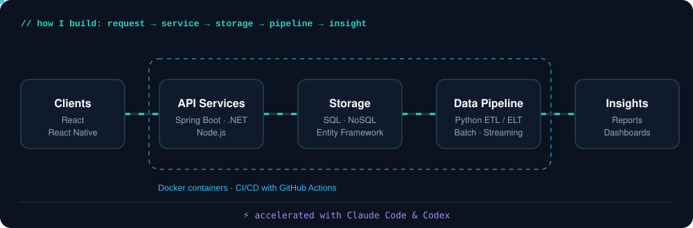

<div align="center">



<br/>

<a href="https://github.com/copirlo20"></a>
&nbsp;


</div>

<br/>

<table>
<tr>
<td valign="top">

### 👋 Xin chào, mình là Đạt

Mình là **Backend Engineer** và **Data Engineer**, tập trung vào việc xây dựng hệ thống ổn định, dễ mở rộng và xử lý dữ liệu một cách sạch sẽ, đáng tin cậy.

- ⚙️ Thiết kế **REST API & Microservices** với *Java/Spring Boot, Node.js*
- 🗄️ Mô hình hoá dữ liệu và tối ưu truy vấn trên *SQL & NoSQL*
- 🔄 Xây dựng **data pipeline** bằng *Python*
- 🐳 Đóng gói và triển khai với *Docker & GitHub Actions*
- 🤖 Tăng tốc phát triển cùng *Claude Code & Codex*

</td>
<td valign="top">

```ts
const dat = {
  roles: ["Backend", "Data"],
  stack: {
    backend: ["Java", "Spring Boot", "Node.js"],
    data: ["SQL", "NoSQL", "Python"],
    client: ["React", "React Native"],
    ops: ["Docker", "GitHub"],
    ai: ["Claude Code", "Codex"],
  },
  available: true,
};
```

</td>
</tr>
</table>

---

<h3 align="center">🏗️ How I Build</h3>

<p align="center">
  
</p>

---

<h3 align="center">🧰 Toolbox</h3>

<p align="center">
  
  <br/>
  
</p>

<p align="center">
  
  
  
  
  
  
</p>

---

<h3 align="center">📈 Activity</h3>

<p align="center">
  
</p>

<p align="center">
  <picture>
    <source media="(prefers-color-scheme: dark)" srcset="https://raw.githubusercontent.com/copirlo20/copirlo20/output/github-snake-dark.svg"/>
    
  </picture>
</p>

---

<h3 align="center">📫 Contact</h3> <p align="center"> 📧 <a href="mailto:copirlo20@gmail.com"><b>copirlo20@gmail.com</b></a> &nbsp;·&nbsp; 🐙 <a href="https://github.com/copirlo20"><b>github.com/copirlo20</b></a> </p> <p align="center">
<a align="center" href="mailto:copirlo20@gmail.com"></a> <a href="https://github.com/copirlo20"></a>
<div align="center"> 


</div>
